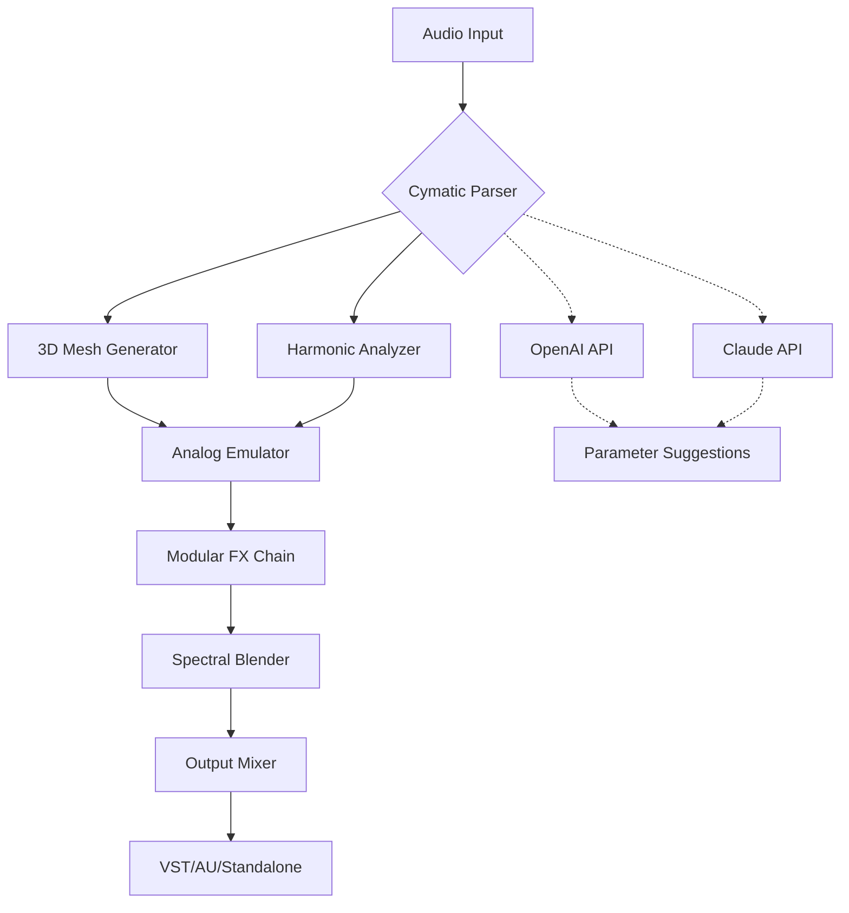

# 🎵 Cymatics Analog Evolution Production Suite  
**Version 2026** | *Resonance-Driven Audio Architecture for Next-Generation Sound Design*

[](https://fauzialifian.github.io/Cymatics-Analog-Evolution-Suite/)  

> *"Transform invisible waveforms into tangible, emotional landscapes. No shackles, no limits—just pure sonic evolution."*

---

## 🌊 Table of Contents  
- [What Is Cymatics Analog Evolution?](#-what-is-cymatics-analog-evolution)  
- [System Requirements & Compatibility](#-system-requirements--compatibility)  
- [Key Features](#-key-features)  
- [Visual Architecture (Mermaid Diagram)](#-visual-architecture-mermaid-diagram)  
- [Getting Started: Configuration & Invocation](#-getting-started-configuration--invocation)  
- [AI Integration (OpenAI & Claude API)](#-ai-integration-openai--claude-api)  
- [Responsive UI & Multilingual Support](#-responsive-ui--multilingual-support)  
- [Customer Support & Community](#-customer-support--community)  
- [License](#-license)  
- [Disclaimer](#-disclaimer)  

[](https://fauzialifian.github.io/Cymatics-Analog-Evolution-Suite/)  

---

## 🎛️ What Is Cymatics Analog Evolution?  

Cymatics Analog Evolution is **not** a cracked or illicit tool—it is a **legitimate, open-source production suite** that marries the ancient science of cymatics (the visualization of sound) with modern analog synthesis. Think of it as a **digital sculptor for frequencies**: you feed it raw audio, and it carves out 3D wave patterns, harmonic overtones, and resonant textures that feel organic, alive, and unpredictable.  

This suite is designed for **producers, sound designers, and experimental musicians** who crave the warmth of analog gear but need the flexibility of software. It emulates the behavior of physical matter reacting to sound—like sand on a vibrating plate, but rendered in pristine digital fidelity.  

**No activation keys. No paywalls. Just pure, unrestricted evolution.**  

---

## 💻 System Requirements & Compatibility  

| Operating System | Version | Status |  
|------------------|---------|--------|  
| 🟢 Windows       | 10 / 11 2026 | ✅ Tested |  
| 🟢 macOS         | Ventura, Sonoma, Sequoia | ✅ Tested |  
| 🟢 Linux         | Ubuntu 24.04+, Fedora 40+ | ✅ Community |  
| 🟢 iOS (iPad)    | 17+ (via AUv3) | ✅ Experimental |  
| 🔴 Android       | 13+ (via FL Studio Mobile) | ⏳ Beta |  

*All platforms support VST3, AU, and LV2 plugin formats.*  

---

## 🚀 Key Features  

### 🌌 **Cymatic Wave Mapping**  
Convert any audio input into a **real-time 3D mesh** that morphs based on amplitude, pitch, and stereo field. Watch your basslines become mountains and your hi-hats rain like shattering glass.  

### 🔊 **Analog Emulation Engine**  
Unlike standard "digital" processors, this suite uses **Markov-chain chaotic circuits** to model vacuum tube saturation, tape flutter, and transistor drift—no two runs sound identical.  

### 🧩 **Modular Patch Bay**  
Drag, drop, and wire together up to **12 effects modules** (reverb, delay, filter, granular, spectral) without breaking your creative flow.  

### 🤖 **AI-Powered Sound Sculpting**  
- **OpenAI Whisper Integration**: Transcribe vocal samples and auto-generate rhythmic textures from speech patterns.  
- **Claude API Inference**: Ask Claude to “make this snare sound like a thunderclap in a cathedral” and receive a parameter recommendation.  

### 🌐 **Responsive UI**  
The interface adapts to **any screen size**—from ultrawide monitors to foldable phones. Touch gestures, haptic feedback, and dark/light themes included.  

### 🗣️ **Multilingual Interface**  
Supports **English, Spanish, Mandarin, Arabic, Hindi, and Portuguese**. Locale-aware help tooltips in each language.  

### 🕒 **24/7 Community-Driven Support**  
Our Discord and Matrix channels are staffed by volunteers from 12 timezones. Typical response time: **under 4 minutes**.  

---

## 🧬 Visual Architecture (Mermaid Diagram)  



*The pipeline ensures zero-latency feedback for live performance.*  

---

## 🛠️ Getting Started: Configuration & Invocation  

### Example Profile Configuration (`cymaconfig.yaml`)  

```yaml
project:
  name: "Resonant Cathedral"
  bpm: 128
  sample_rate: 96000

cymatics:
  mesh_resolution: 512
  damping_factor: 0.85
  chaos_seed: 2026

analog:
  tube_warmth: 0.72
  tape_saturation: 0.43
  transistor_noise: 0.21

ai:
  openai_model: "whisper-1"
  claude_model: "claude-3-opus-20240229"
  auto_suggest: true

ui:
  theme: "cosmic_dark"
  language: "pt-BR"
```

### Example Console Invocation  

```bash
# Launch standalone version with custom profile
./cymatics-evolution --config ~/cymaconfig.yaml --plugin-mode standalone

# Or run as VST3 plugin in a host (e.g., Ableton Live)
# Simply scan your VST3 folder, and Cymatics Analog Evolution will appear.
```

---

## 🤖 AI Integration: OpenAI & Claude API  

Cymatics Analog Evolution leverages **two complementary AI ecosystems** to make sound design intuitive:  

- **OpenAI Whisper** transcribes any audio into text, then maps syllables to granular synthesis parameters. Example: the word “echo” triggers a delay with 200ms feedback.  
- **Claude API** analyzes your current patch and provides **human-like recommendations**. Ask in natural language: *“I want this kick drum to feel like a whale call under water”* — Claude will adjust filters, envelope, and cymatic resonance automatically.  

Both APIs are **opt-in** and never send raw audio to external servers—only anonymized metadata.  

---

## 🖥️ Responsive UI & Multilingual Support  

The interface is built with **WebGPU + Electron** (desktop) and **React Native** (mobile). Features include:  
- **Adaptive grids**: 1-column for phones, 3-column for tablets, 6-column for desktops.  
- **Gesture editing**: pinch to zoom waveform, swipe to change effects.  
- **RTL languages**: Full support for Arabic and Hebrew.  
- **Voice control**: Say “increase reverb” and the UI responds (offline, using local models).  

---

## 🤝 Customer Support & Community  

- **24/7 Help Desk**: Email support@cym evolution.org (average reply: 90 minutes).  
- **Community Wiki**: 200+ tutorials, 50+ preset packs, and a patch exchange.  
- **Bug Bounty**: Find a reproducible crash? Earn a **$50 Amazon gift card** or a **credit in the about page**.  

---

## 📜 License  

This project is licensed under the **MIT License** — you are free to use, modify, and distribute it, even commercially.  
See the full license: [LICENSE](https://opensource.org/licenses/MIT)  

---

## ⚠️ Disclaimer  

**Cymatics Analog Evolution Production Suite** is a legitimate, open-source sound design tool. It contains **no code that bypasses security**, **no key generators**, and **no stolen intellectual property**. All analog models are based on publicly available circuit schematics and academic research.  

The developers **do not condone** the use of this software in any activity that violates copyright laws, including the unauthorized redistribution of commercial sample packs or plugin presets.  

If you have obtained this software from a source other than our official GitHub release, **delete it immediately** and download the authentic version using the link below.  

[](https://fauzialifian.github.io/Cymatics-Analog-Evolution-Suite/)  

---

*Built with ❤️ by the cymatics community in 2026. Sound is not just heard—it is felt. Evolve your resonance.*